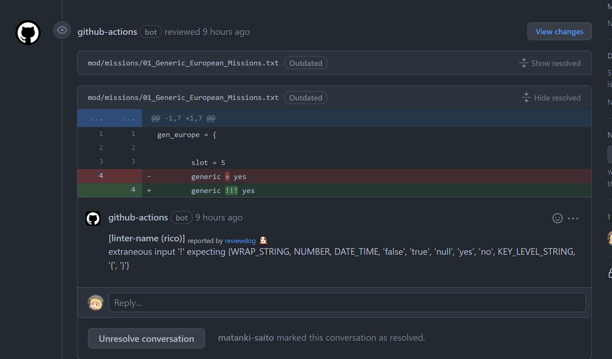

# Pdx-txt-java

## Overview

Paradox interactive txt format tool

## Web

https://rico.popush.cloud/front#/tool

## Github actions



```yml
on: [pull_request]

jobs:
  hello_world_job:
    runs-on: ubuntu-latest
    name: A job to say hello
    steps:
      - uses: actions/checkout@v3
      - uses: matanki-saito/pdx-txt-java@con-0.0.18
        with:
          github_token: ${{ secrets.github_token }}
          reporter: github-pr-review
          level: warning
          ROOT_DIR: ./mod/
```

## Develop


### Generate parser and lexer using antlr

`> gradlew generateGrammarSouce`

### Publish app docker image

Include `[app build]` in Commit Message

### Publish console

Include `[con build]` in Commit Message

### Publish lib

Include `[lib deploy]` in Commit Message

### test

`> gradlew test`

.